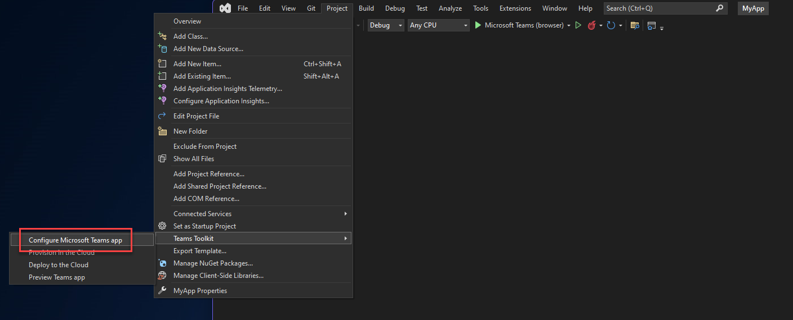

# Teams app with a simple Power Platform Dataverse API integration

I wanted to see if I can use the identity which lives in Microsoft Teams to retrieve data from the Power Platform Dataverse.  
This service offers a REST API which can be leveraged to do almost everything. 

Be aware, this is a proof of concept and doesn't contain production ready code!

The component `Graph` contains the default logic, provided by the Teams App template in Visual Studio, along with some new functionality to retrieve data from the Power Platform environment.  
Endpoints which are used are `WhoAmI`, retrieving user information, and `accounts`, retrieving table data.

# Set up

When starting this solution you need to use the `Teams Toolkit` and invoke the `Configure Microsoft Teams app`, available in Visual Studio 2022.


This will configure the application in Microsoft 365 and Azure Active Directory.  
The `appsettings.Development.json` should now look similar like the following example:
```json
{
  "Logging": {
    "LogLevel": {
      "Default": "Information",
      "Microsoft": "Warning",
      "Microsoft.Hosting.Lifetime": "Information"
    }
  },
  "AllowedHosts": "*",
  "TeamsFx": {
    "Authentication": {
      "ClientId": "a4774a4d-baad-4c7e-984a-e3d177da58b5",
      "ClientSecret": "9tZSB2YWx1ZSB0aGlzIGlzIGFuZCBJIGRvbnQgd2tub3cgd2h",
      "OAuthAuthority": "https://login.microsoftonline.com/76ffb559-59c6-4ffc-be99-184854e23d0d"
    }
  }
}
```
As you can see, it now contains the `ClientId` of your new App Registration and the created secret belonging to it (`ClientSecret`). Needless to say, you don't want to commit this secret in any of your repositories!

Do make sure you're logged in to an environment where you are an Administrator on both Azure Active Directory and Microsoft 365, as you need some extensive permissions to set this all up.

Next thing you need to do is to make sure the created App Registration has permissions to access Dataverse, located within Dynamics 365. For this you need to add the API Permissions to Dynamics 365 with the `user_impersonation` scope.  


Don't forget to press the button `Grant admin consent for [organization]`. If you do, your users will get an error message when providing their consent to the Teams Application later on in the process.

# Sample usage

By default, the application can be started using the debugger in Visual Studio 2022. A new browser window is started which will navigate to Teams, asking you to add the application.  
After adding, you're in the application and everything should work.